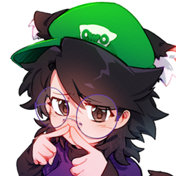

# WeebOwO Discord Bot Website 💜💚

A modern, animated invite website for **WeebOwO** - a fun Discord bot with lots of silly and useful commands created by **weebo64**.

## 🎨 About the Website

This is the official invite and showcase website for WeebOwO, featuring her signature purple and green color scheme with modern animations and interactive elements.

### Visual Design
- **WeebOwO's Colors**: Vibrant purple (#9300C3) and lime green (#4AC300)
- **Animated Particle Background**: 100 floating particles creating a dynamic, living background
- **Smooth Animations**: Fade-ins, parallax scrolling, hover effects, and sparkle cursor trails
- **Glassmorphism UI**: Modern frosted glass effects on cards and sections
- **Floating Bot Avatar**: Continuous floating animation with glowing pulse effect

### Features
- **🔴 Live Server Count**: Displays how many servers WeebOwO is currently in, updated in real-time
- **🌓 Theme Switcher**: Toggle between Dark Mode, Light Mode, or System preference
- **📱 Fully Responsive**: Works beautifully on desktop, tablet, and mobile
- **⚡ Fast & Smooth**: Hardware-accelerated animations running at 60fps
- **✨ Interactive Elements**: Sparkles follow your cursor, cards lift on hover

### Command Showcase
The website displays all of WeebOwO's commands organized by category:
- Fun commands (hugs, pats, ships, 8ball, etc.)
- Music & media (YouTube/Spotify playback, downloads)
- Utility & info (user info, server info, AFK system)
- Mario Kart Wii friend codes (with regions and modpacks)
- AutoMod and logging features

## � About WeebOwO

**WeebOwO** is a Discord bot created by **Weebo64** with a focus on fun, silly commands and useful server moderation features. She's designed to be friendly, cute, and helpful - bringing joy to Discord servers with commands like `/weebowo` for random cute images, music playback, interactive games, and more.

### WeebOwO's Personality
- Fun and silly :3
- Helpful with moderation
- Loves music and games
- Mario Kart Wii enthusiast
- Always there to make your server more fun!

### Character Design
WeebOwO's character is originally by Weebo64, but her art is created by **kytronix** and **funnyhoohooman**, featuring her signature purple and green aesthetic.

## 🎨 Design Credits

- **Website Design**: Inspired by carl.gg's website
- **Bot Creator**: weebo64
- **Character Art**: kytronix & funnyhoohooman
- **Color Scheme**: WeebOwO's signature purple and green colors

## 🌐 Live Features

### Real-Time Statistics
The website connects to WeebOwO's API to display:
- Current server count
- Live updates when the bot joins new servers
- Animated number counter on page load

### Theme System
Three theme options with persistent storage:
- **🌙 Dark Mode**: Full vibrant colors on dark navy background
- **☀️ Light Mode**: Clean, bright theme with subtle purple/green accents
- **💻 System**: Automatically matches your operating system's theme preference

## Contact & Support

- **Creator**: @weebo64 on Discord
- **Website**: [weebo64.com](https://www.weebo64.com)
- **Support Server**: discord.gg/3knu2FNqDG
- **Help Channel**: #help-about-the-bot

## 🎯 Purpose

This website serves as:
- An invite page for adding WeebOwO to your Discord server
- A showcase of all her commands and features
- A demonstration of her personality and design aesthetic
- A hub for users to learn about what WeebOwO can do

---

**Made with 💖 by weebo64**

*Have fun with the bot :3*

